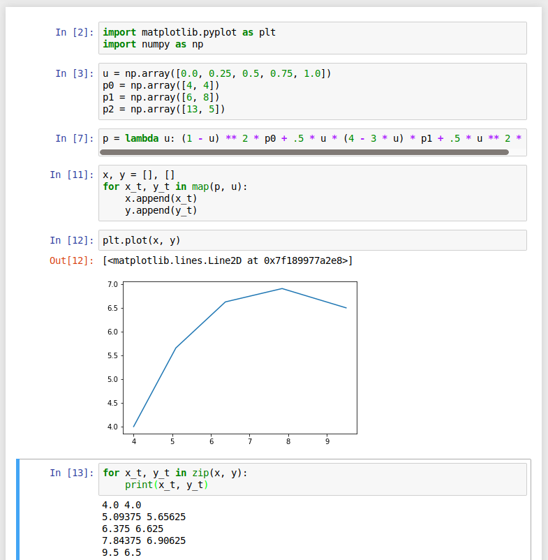
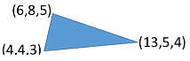

## Parametric Curves

1. What is the curves value at u = { 0.0, 0.25. 0.5, 0.75, 1.0 } where
   $p(u) = (1 ‐ u)^2 p_0 + .5u(4 ‐ 3u) p_1 + .5 u^2 p_2$
   and $p_0 is (4,4) $, $p_1$ is (6,8) , and $p_2$ is (13,5)?

   * $p(0.0) = (4.0, 4.0)$
   * $p(0.25) = (5.09375, 5.65625)$
   * $p(0.5) = (6.375, 6.625)$
   * $p(0.75) = (7.84375, 6.90625)$
   * $p(1.0) = (9.5, 6.5)$

   

   *Note: I used Python to calculate them*

2. a. What are the basis functions for the Bezier curve with 5 control points?

   * $f_0 = (1 - u)^4$
   * $f_1 = 4u(1 - u)^3$
   * $f_2 = 6u^2(1 - u)^2$
   * $f_3 = 4u^3(1 - u)$
   * $f_4 = u^4$

   b. What is the degree of this set of basis curves?

   * The degree of this set of basis curves is 4. A generic way to calculate it is n_points - 1

3. Consider the poly-line approximation (see slides) for the curve in Q1. How many points should we use to sample the curve and why? Hint: in Q1 we sample five points (u = 0.0, u = 0.25... etc.), do you think this is enough samples, why or why not?

   * It depends because the more points we use the higher quality will be. However, there is a trade-off in doing that. The performance will suffer. On the other side, the less points we use the lesser quality will be. However, this will improve the performance. So, the best way to determine how many points we should use to sample the curve is by doing experiments and trust our eyes to get the least amount of points with the best quality (the edge between the two sides).
   * No, it's not enough because we can still see the line segments, which are being used to build a curve. This means we need to have more samples so that we can't see the segments; we need enough samples so that we only see a curve.

----

## Polygons/Vectors

1. What is the intersection of the two edges of the following polygon and the scan line s = 20? How many pixels are turned on (assuming the pixels are unit size)?

   * Intersection 1
     $$
     m = \frac{25 - 15}{15 - 10} = 2
     $$

     $$
     y = mx + b \\
     15 = 2 \times 10 + b \\
     b = -5
     $$

     $$
     20 = 2 \times x - 5
     x = 12.5
     $$

     $$
     (x, y) = (12.5, 20) \\
     (x, y) = (12, 20)
     $$

   * Intersection 2
     $$
     m = \frac{30 - 1}{25 - 30} = -\frac{29}{5}
     $$

     $$
     y = mx + b \\
     1 = -\frac{29}{5} \times x + 175 \\
     x = \frac{775}{29}
     $$

     $$
     (x, y) = (\frac{775}{29}, 20) \\
     (x, y) = (27, 20)
     $$

   * The number of pixels are turned on is $27 - 12 = 15$

     ​

2. What are the angles to the nearest degree between the edges of the following 3D triangle?

   

* *Formula:* $\theta = \arccos (\frac{\vec{A} \cdot \vec{B}}{|\vec{A}| \times |\vec{B}|}) $

  * $$
    \theta_1 = \arccos (
    \frac{\begin{bmatrix} 7 \\ -3 \\ -1 \end{bmatrix} \cdot
    \begin{bmatrix} -2 \\ -4 \\ -2 \end{bmatrix}}
    {\sqrt{59} \times \sqrt{24}}
    ) \\

    \theta_1 = \arccos(0) \\
    \theta_1 = 90^\circ
    $$

    $$
    \theta_2 = \arccos (
    \frac{\begin{bmatrix} -9 \\ -1 \\ -1 \end{bmatrix} \cdot
    \begin{bmatrix} -7 \\ 3 \\ 1 \end{bmatrix}}
    {\sqrt{83} \times \sqrt{59}}
    ) \\

    \theta_2 = \arccos(\frac{59}{\sqrt{83} \times \sqrt{59}}) \\
    \theta_2 = \arccos(\sqrt{\frac{59}{83}}) \\
    \theta_2 = 32.53^\circ \\
    \theta_2 = 33^\circ
    $$

$$
\theta_3 = \arccos (
\frac{\begin{bmatrix} 2 \\ 4 \\ 2 \end{bmatrix} \cdot
\begin{bmatrix} 9 \\ 1 \\ 1 \end{bmatrix}}
{\sqrt{24} \times \sqrt{83}}
) \\

\theta_3 = \arccos(\frac{24}{\sqrt{24} \times \sqrt{83}}) \\
\theta_3 = 57.47^\circ \\
\theta_3= 57^\circ
$$

3. a. What is the normal for the triangle in Q2?

$$
A = \begin{bmatrix} 13 - 4 \\ 5 - 4 \\ 4 - 3 \end{bmatrix} 
B = \begin{bmatrix} 6 - 4 \\ 8 - 4 \\ 5 - 3 \end{bmatrix} \\

A = \begin{bmatrix} 9 \\ 1 \\ 1 \end{bmatrix} 
B = \begin{bmatrix} 2 \\ 4 \\ 2 \end{bmatrix} \\

A \times B = 
\begin{bmatrix} 
1 \cdot 2 - 1 \cdot 4 \\
1 \cdot 2 - 9 \cdot 2 \\
9 \cdot 4 - 1 \cdot 2
\end{bmatrix} \\

A \times B = \begin{bmatrix} -2 \\ -16 \\ 34 \end{bmatrix}
$$

​	b. What is the plane equation for the triangle in Q2?
$$
\begin{bmatrix} a - 4 \\ b - 4 \\ c - 3 \end{bmatrix} 
\cdot
\begin{bmatrix} -2 \\ -16 \\ 34 \end{bmatrix} 
= 0 \\

-2a + 8 - 16b + 64 + 34c - 102 = 0 \\
-2a - 16b + 34c - 30 = 0
$$
​