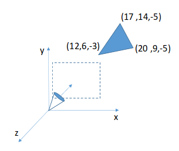

# Viewing

1. Consider the oblique view that has a DOP vector of (0.1, -0.1, 0.9). If the viewing projection is on the XY plane, where is the projected triangle?

   * $$
     \begin{bmatrix} 
     1& 0 & -\frac{0.1}{0.9} & 0 \\
     0 & 1 & \frac{0.1}{0.9} & 0 \\
     0 & 0 & 0 & 0 \\
     0 & 0 & 0 & 1 
     \end{bmatrix}

     \cdot

     \begin{bmatrix}
     17 \\
     14 \\
     -5 \\
     1
     \end{bmatrix}

     =

     \begin{bmatrix}
     \frac{158}{9} \\
     \frac{121}{9} \\
     0 \\
     1
     \end{bmatrix}
     $$

   * $$
     \begin{bmatrix} 
     1& 0 & -\frac{0.1}{0.9} & 0 \\
     0 & 1 & \frac{0.1}{0.9} & 0 \\
     0 & 0 & 0 & 0 \\
     0 & 0 & 0 & 1 
     \end{bmatrix}

     \cdot

     \begin{bmatrix}
     20 \\
     9 \\
     -5 \\
     1
     \end{bmatrix}

     =

     \begin{bmatrix}
     \frac{185}{9} \\
     \frac{76}{9} \\
     0 \\
     1
     \end{bmatrix}
     $$

   * $$
     \begin{bmatrix} 
     1& 0 & -\frac{0.1}{0.9} & 0 \\
     0 & 1 & \frac{0.1}{0.9} & 0 \\
     0 & 0 & 0 & 0 \\
     0 & 0 & 0 & 1 
     \end{bmatrix}

     \cdot

     \begin{bmatrix}
     12 \\
     6 \\
     -3 \\
     1
     \end{bmatrix}

     =

     \begin{bmatrix}
     \frac{37}{3} \\
     \frac{17}{3} \\
     0 \\
     1
     \end{bmatrix}
     $$

2. Show that the angles of the triangle are not preserved across the transformation. **TODO**

   * $$
     \theta_1 = \arccos (
     \frac{\begin{bmatrix} 3 \\ -5 \\ 0 \end{bmatrix} \cdot
     \begin{bmatrix} -5 \\ -8 \\ 2 \end{bmatrix}}
     {\sqrt{34} \times \sqrt{93}}
     ) \\

     \theta_1 = \arccos(\frac{37}{\sqrt{34} \times \sqrt{93}}) \\
     \theta_1 = 63.60^\circ
     \\
     \theta_1^{'} = \arccos (
     \frac{\begin{bmatrix} 3 \\ -5 \\ 0 \end{bmatrix} \cdot
     \begin{bmatrix} -\frac{47}{9} \\ -\frac{79}{9} \\ 0 \end{bmatrix}}
     {5.83095 \times 10.21376}
     ) \\

     \theta_1^{'} = \arccos(\frac{28.22222}{{5.83095 \times 10.21376}}) \\
     \theta_1^{'} = 61.71^\circ \\
     $$

   * $$
     \theta_2 = \arccos (
     \frac{\begin{bmatrix} -3 \\ 5 \\ 0 \end{bmatrix} \cdot
     \begin{bmatrix} -8 \\ -3 \\ 2 \end{bmatrix}}
     {5.83095 \times 8.77496}
     ) \\

     \theta_2 = \arccos(\frac{9}{5.83095 \times 8.77496}) \\
     \theta_2 = 79.87^\circ
     \\

     \theta_2^{'} = \arccos (
     \frac{\begin{bmatrix} -3 \\ 5 \\ 0 \end{bmatrix} \cdot
     \begin{bmatrix} -\frac{74}{9} \\ -\frac{25}{9} \\ 0 \end{bmatrix}}
     {5.83095 \times 8.6788}
     ) \\

     \theta_2^{'} = \arccos(\frac{10.7778}{{5.83095 \times 8.6788}}) \\
     \theta_2^{'} = 77.70^\circ \\
     $$

   * $$
     \theta_3 = \arccos (
     \frac{\begin{bmatrix} 8 \\ 3 \\ -2 \end{bmatrix} \cdot
     \begin{bmatrix} 5 \\ 8 \\ -2 \end{bmatrix}}
     {8.7750 \times 9.64365}
     ) \\

     \theta_3 = \arccos(\frac{68}{8.7750 \times 9.64365}) \\
     \theta_3 = 36.53^\circ
     \\

     \theta_3^{'} = \arccos (
     \frac{\begin{bmatrix} \frac{74}{9} \\ \frac{25}{9} \\ 0 \end{bmatrix} \cdot
     \begin{bmatrix} \frac{47}{9} \\ \frac{70}{9} \\ 0 \end{bmatrix}}
     {8.67877 \times 9.36832}
     ) \\

     \theta_3^{'} = \arccos(\frac{64.54321}{{8.67877 \times 9.36832}}) \\
     \theta_3^{'} = 37.45^\circ \\
     $$

3. Consider the perspective projections shown. If the viewing direction is in the negative Z direction and the image plane is at z = 1, where is the projected triangle?

   * $$
     \begin{bmatrix} 
     1& 0 & 0 & 0 \\
     0 & 1 & 0 & 0 \\
     0 & 0 & 1 & 0 \\
     0 & 0 & -1 & 0 
     \end{bmatrix}

     \cdot

     \begin{bmatrix}
     17 \\
     14 \\
     -5 \\
     1
     \end{bmatrix}

     =

     \begin{bmatrix}
     17 \\
     14 \\
     -5 \\
     5
     \end{bmatrix}

     =

     \begin{bmatrix}
     \frac{17}{5} \\
     \frac{14}{5} \\
     -1 \\
     1
     \end{bmatrix}
     $$

   * $$
     \begin{bmatrix} 
     1& 0 & 0 & 0 \\
     0 & 1 & 0 & 0 \\
     0 & 0 & 1 & 0 \\
     0 & 0 & -1 & 0 
     \end{bmatrix}

     \cdot

     \begin{bmatrix}
     20 \\
     9 \\
     -5 \\
     1
     \end{bmatrix}

     =

     \begin{bmatrix}
     20 \\
     9 \\
     -5 \\
     5
     \end{bmatrix}

     =

     \begin{bmatrix}
     4\\
     \frac{9}{5} \\
     -1 \\
     1
     \end{bmatrix}
     $$

   * $$
     \begin{bmatrix} 
     1& 0 & 0 & 0 \\
     0 & 1 & 0 & 0 \\
     0 & 0 & 1 & 0 \\
     0 & 0 & -1 & 0 
     \end{bmatrix}

     \cdot

     \begin{bmatrix}
     12 \\
     6 \\
     -3 \\
     1
     \end{bmatrix}

     =

     \begin{bmatrix}
     12 \\
     6 \\
     -3 \\
     3
     \end{bmatrix}

     =

     \begin{bmatrix}
     4 \\
     2 \\
     -1 \\
     1
     \end{bmatrix}
     $$

4. If the camera and the triangle are translated by the same displacement, will the projected triangle move relative to the image plane? Why or why not?

   **TODO**

   * Yes, because we see the triangle through the image plane