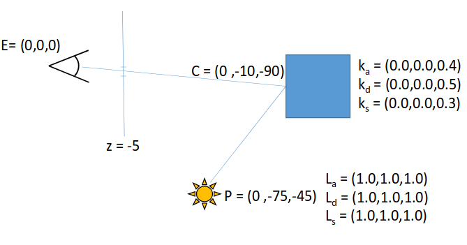
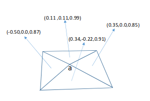

## Shading

Consider the set up shown, assuming eye position E, object collision point C, and a single point light at the position P shown. Assume the object is a cube aligned with the global coordinate frame, the image plane is parallel to the XY plane at z = -5, and the material k and light properties L are as shown. Assuming the phong shading model:

> I = to source
>
> v = to viewer
>
> n = normal *(Since the surface is parallel to the XY plane at z = -5, we just need to find a normal to the plane XY with the correct direction.)*
>
> r = perfect reflector

$$
I = \begin{bmatrix} 0 \\ 75 \\ 45 \end{bmatrix} \
v = \begin{bmatrix} 0 \\ 10 \\ 90 \end{bmatrix} \
n = \begin{bmatrix} 0 \\ 0 \\ 1 \end{bmatrix} \\
$$

$$
r = -I - 2(-I \cdot n)n \\
r = \begin{bmatrix} 0 \\ -75 \\ -45 \end{bmatrix} + 90 \begin{bmatrix} 0 \\ 0 \\ 1 \end{bmatrix} \\
r = \begin{bmatrix} 0 \\ -75 \\ 45 \end{bmatrix}
$$

1. What is the diffuse contribution to the pixel (seen from the side view) for this set up?

   * $$
     \cos{\theta} = \frac{I \cdot n}{|I| \times |n|} \\
     \cos{\theta} = 
     \frac{
         \begin{bmatrix} 0 \\ 75 \\ 45 \end{bmatrix}
         \cdot
         \begin{bmatrix} 0 \\ 0 \\ 1 \end{bmatrix}
     }
     {
         \sqrt{7650} \times 1
     } \\
     \cos{\theta} = \frac{45}{87.4643} \\
     \cos{\theta} = 0.5145
     $$

   * $$
     diffuse =  k_d L_d \cos{\theta} \\
     diffuse = 
     \begin{bmatrix}
     0.0 \times 1.0 \\
     0.0 \times 1.0 \\
     0.5 \times 1.0 
     \end{bmatrix}
     \times 0.5145 \\
     diffuse = 
     \begin{bmatrix} 0 \\ 0 \\ 0.2572 \end{bmatrix} \\
     $$

   $$
   diffuse_r = 0 \\
   diffuse_g = 0 \\
   diffuse_b = 0.2572
   $$

2. What is the specular contribution to the pixel assuming the shininess coefficient is 5?

   * $$
     \cos{\theta} = 0.9939 \\ 
     \cos{\phi} = \frac{v \cdot r}{|v| \times |r|} \\
     \cos{\phi} = 
     \frac{
     	\begin{bmatrix} 0 \\ 10 \\ 90 \end{bmatrix}
     	\cdot
     	\begin{bmatrix} 0 \\ -75 \\ 45 \end{bmatrix}
     }
     {
     	\sqrt{8200} \times \sqrt{7650}
     } \\

     \cos{\phi} = \frac{3300}{7920.2273} \\
     \cos{\phi} = 0.4166
     $$

   * $$
     specular = k_s L_s \cos^\alpha{\phi} \\
     specular = 
     \begin{bmatrix}
     0.0 \times 1.0 \\
     0.0 \times 1.0 \\
     0.3 \times 1.0 
     \end{bmatrix}
     \times 0.4166^{0.9939}  \\
     specular = 
     \begin{bmatrix} 0 \\ 0 \\ 0.1256 \end{bmatrix}
     $$

   * $$
     specular_r = 0 \\
     specular_g = 0 \\
     specular_b = 0.1256
     $$

## Smooth Shading

Consider the simple 4 polygon set. Assuming we wish to use smooth shading for the surface it represents.

3. What is the vertex normal at the point **a** shown?

   * $$
     n = \frac{n_1 + n_2 + n_3 + n_4}{|n_1| + |n_2| + |n_3| + |n_4|} \\
     n = 
     \frac{
         \begin{bmatrix} 0.11 \\ 0.11 \\ 0.99 \end{bmatrix} +
         \begin{bmatrix} 0.35 \\ 0.0 \\ 0.85 \end{bmatrix} + 
         \begin{bmatrix} 0.34 \\ -0.22 \\ 0.91 \end{bmatrix} + 
         \begin{bmatrix} -0.50 \\ 0.0 \\ 0.87 \end{bmatrix}
     }
     { 1.0021 + 0.9192 + 0.9960 + 1.0034 } \\

     n = \frac{\begin{bmatrix} 0.3 \\ -0.11 \\ 3.62 \end{bmatrix}}{3.9209} \\
     n = \begin{bmatrix} 0.0765 \\ -0.0280 \\ 0.9233 \end{bmatrix}
     $$

4. Why do we compute the vertex normal? *Hint: how do we use this in Q2 above?*

   * We compute the vertex normal because we want to achieve a smooth shading. If we only use regular normals, we'll end up with discrete transitions (This will create facets on the surface).
   * By having vertex normals, we can easily interpolate the shading (This will create a smooth shading). For example, if we use the phong shading model, the "n" in the formula can be interpolated to get a smooth shading.

