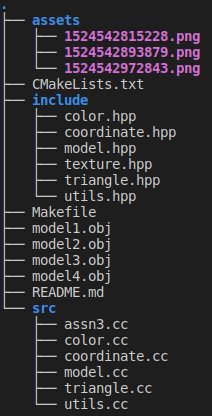
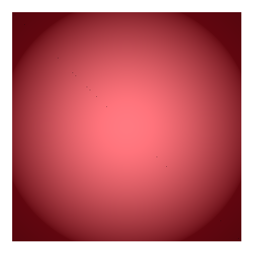
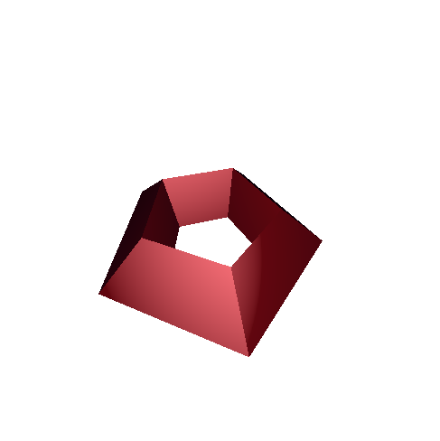
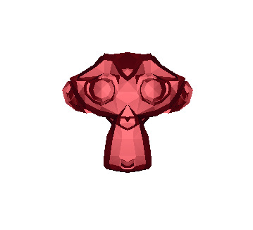

# Ray-tracer for triangle renderer

This project is about ray tracing and shading 3D object models from any wavefront object (.obj) files. Following are tasks that need to be done:

- [x] Flat Shading (50 pts)
- [x] Smooth Shading / Phong Smoothing (20 pts)
- [x] Bump Mapping (20 pts)
- [x] Triangle Remesh (20 pts)
- [x] Well Documentation (10 pts)


## Project Skeleton



* **include**: this directory contains all the header files (*.hpp)
* **src**: this directory contains all the source codes (*.cc)

## How to compile?

In this project, I used CMake to manage my program and dependencies. To make it easy, I have a makefile that will do everything. So, to compile/build, simply run the following command:

```sh
make
```


# How to test/run?

Again, I have a makefile that does this too. You can simply run:

```sh
make test
```

This command will ask you the file path of your model.


# General Setting

I setup the eye/camera and the light at the same position, which is in front of the 3D object. For the object's material, I used the ruby material from OpenGL's constants (That's why you'll see that all the objects are red).


## Flat Shading

I used the Barycentric solution to help me in both the ray tracing and shading. At first, it was hard to implement the flat shading algorithm. But, then, I realized that I needed to restructure my project and add more helpers, such as operator overloadings. It turned out that operator overloadings helped me a lot in developing the algorithm. So, if you see my coordinate.hpp and color.hpp, they have a bunch of operator overloadings. I also added some optimizations, such as move semantic. Following is the results from the flat shading:

Cube:


Object #2 (multi prisms, maybe?)



Suzanne - the blender monkey




##Smooth Shading / Phong Smoothing

This implementation is pretty much similar to the flat shading. The only differences are just that I needed to calculate the vertex normals and use the vertex normals and bilinear interpolation to do the phong shading. 


## Bump Mapping

For this particular task, I didn't do only bump mapping, but bump mapping combined with texture. It's very similar to the example on the slides where you have a can of soda and bubbles as the bump map. Then, when they're combined it becomes a realistic cold can of soda.

Following is how my bump mapping works:

* I have a program that can resize and convert png, jpeg, and gif images to pgm. (It's called convert.go. In the submission, I've provided a statically compiled program called "convert").  The program will then process the image and name the converted image, "bump_map.png"

  ```shell
  cat your_image.png | ./convert 800 800
  ```

  ​

* Then, my c++ program will read that converted image and store it in a 2D array and use it as the bump map (the c++ program will read the texture implicitly)

  ```sh
  make test
  ```

  ​

*Note: I chose pgm format because it's very easy to be parsed*


## Triangle Remesh

There are many algorithms out there that does this. However, for this particular project, I decided to use the **ear clipping** from [this original paper](https://www.geometrictools.com/Documentation/TriangulationByEarClipping.pdf). I found that the ear clipping algorithm was the easiest one to be implemented and at the same time, the running time was not terribly bad (O($n^3$)). Especially, n in the running complexity means the number of sides in the polygon. So, I don't think that this will slow down performance a lot.